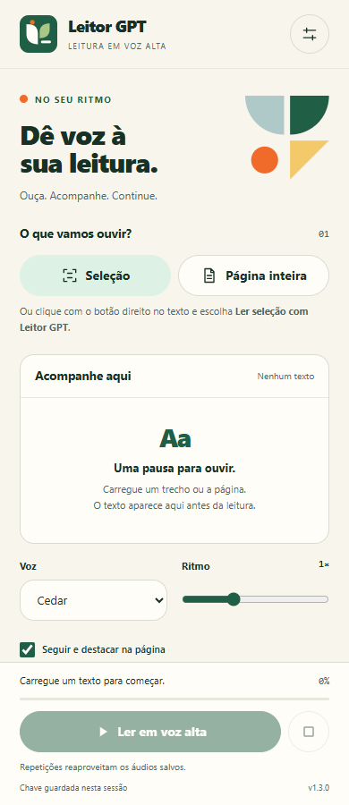
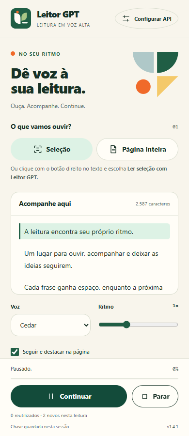
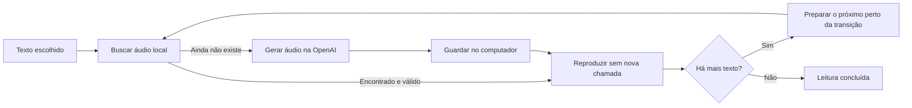

# Leitor de Tela Neural IA


**Transforme o texto da página em voz, sem perder o lugar na leitura.**

Extensão para Google Chrome, instalada localmente, com geração de fala pela API OpenAI. Selecione um trecho ou carregue a página inteira, confira a prévia e ouça até o fim. O painel e a página acompanham a leitura por frases.

**Chrome 116+ · Manifest V3 · JavaScript · OpenAI TTS · Versão 1.3.0**

[Instalação](#instalação) · [Como usar](#como-usar) · [Economia](#economia-sem-interromper-a-leitura) · [Privacidade](#privacidade-e-permissões) · [Desenvolvimento](#desenvolvimento-e-testes)

## Veja a extensão

<table>
  <tr>
    <td align="center"><strong>Escolha o texto</strong></td>
    <td align="center"><strong>Acompanhe a leitura</strong></td>
  </tr>
  <tr>
    <td></td>
    <td></td>
  </tr>
</table>

*Capturas da interface real, com texto de demonstração e áudio de teste. Nenhuma chave pessoal aparece nas imagens.*

## O que você pode fazer

- **Ouvir uma seleção ou a página:** inicie pelo painel ou pelo botão direito do mouse.
- **Acompanhar sem procurar o trecho:** destaque por frases e rolagem automática quando a posição é acessível.
- **Ler até o fim:** a transição entre os áudios é automática, sem novos cliques.
- **Ajustar o ritmo:** pause, continue, pare e altere a velocidade entre 0,5× e 2×.
- **Reutilizar áudios:** repita o mesmo conteúdo com a mesma voz sem nova chamada à API enquanto o áudio estiver no cache.

## Instalação

### Você só quer usar a extensão

1. No GitHub, clique em **Code → Download ZIP** e extraia os arquivos para uma pasta permanente.
2. Abra `chrome://extensions` no Google Chrome.
3. Ative **Modo do desenvolvedor**.
4. Clique em **Carregar sem compactação** e selecione a pasta **`extension`** deste repositório — ela contém `manifest.json`.
5. Abra o menu de extensões do Chrome e fixe **Leitor GPT** na barra.

Não é necessário instalar Node.js, executar um servidor ou compilar o projeto para usar a extensão.

### Atualizar uma instalação

Substitua os arquivos da pasta instalada pelos da nova versão. Em `chrome://extensions`, clique em **Recarregar** no cartão Leitor GPT. Atualize também a página que deseja ouvir e selecione o texto novamente.

> Se você já usa o pacote `leitor-gpt.zip`, mantenha a pasta instalada e substitua o conteúdo dela pelo conteúdo de `extension`. Evite colocar uma pasta dentro da outra: o `manifest.json` deve ficar na raiz da pasta carregada pelo Chrome.

## Configurar a OpenAI

Você precisa de uma chave pessoal com acesso ao modelo **`gpt-4o-mini-tts`**. A API exige internet e tem cobrança própria, separada de planos do ChatGPT. O modelo não está disponível no Free tier da API. Consulte a [documentação do modelo](https://developers.openai.com/api/docs/models/gpt-4o-mini-tts).

1. Configure o uso pago na [plataforma OpenAI](https://platform.openai.com/settings/organization/billing/overview).
2. Crie uma chave em [API keys](https://platform.openai.com/api-keys), no projeto que vai utilizar.
3. Nas permissões da chave, use **Restricted → Model capabilities → Text-to-speech (`/v1/audio/speech`) → Request**. A extensão não precisa de acesso às demais APIs. Uma chave **Read only** não permite gerar fala.
4. Confira se o projeto permite `gpt-4o-mini-tts` em **Settings → Limits → Allowed models**.
5. No painel da extensão, abra o botão de configurações, insira a chave e clique em **Guardar chave**.

Alterações nas permissões podem levar alguns minutos para entrar em vigor. A chave fica guardada somente durante a sessão do Chrome, sem sincronização. Use **Esquecer** para removê-la.

## Como usar

### Um texto selecionado

Selecione o texto na página, clique com o botão direito sobre ele e escolha **Ler seleção com Leitor GPT**. O painel abrirá com a prévia. Clique em **Ler em voz alta** uma vez.

Você também pode clicar no ícone da extensão nessa aba e usar o botão **Seleção**.

### Uma página inteira

Clique no ícone do Leitor GPT na aba desejada e depois em **Página inteira**. Confira a prévia e inicie. O texto já renderizado abaixo da área visível também pode ser incluído.

### Durante a leitura

| Controle | Resultado |
| --- | --- |
| Pausar / Continuar | Interrompe e retoma o áudio na posição atual. |
| Parar | Encerra a leitura e aborta a chamada em andamento. |
| Ritmo | Altera a velocidade localmente, sem gerar outro áudio. |
| Seguir e destacar na página | Destaca a frase e rola a página quando necessário. |
| Limpar áudios salvos | Apaga o cache local e encerra uma eventual leitura ativa. |

O acompanhamento é **aproximado por frase**: a API de fala usada não fornece marcações de tempo por palavra. Em páginas que bloqueiam a captura de posições, o texto ainda pode ser ouvido com acompanhamento no painel.

## Economia sem interromper a leitura

A otimização preserva o texto integral. Ela não resume, corta frases nem exige que você peça o restante manualmente.



### O que reduz o consumo

- **Cache local de áudio:** o mesmo texto, voz, modelo, instruções e chave identificam uma gravação reutilizável. Reabrir o painel não perde esse cache.
- **Preparação controlada:** fica em memória o áudio atual e, no máximo, o próximo. A próxima geração começa perto da transição, considerando a latência observada e a velocidade de reprodução.
- **Instruções menores:** a API recebe uma orientação curta e o texto necessário, sem histórico de conversa, HTML ou imagem da página.
- **Processamento local:** seleção, divisão de texto, destaque, rolagem e velocidade não chamam modelos.
- **Requisições iguais em andamento:** dentro do mesmo painel, compartilham a geração em vez de duplicá-la.

O cache é limitado a **64 MB e 200 áudios**. Um áudio pode ser reutilizado por **7 dias**; itens vencidos são removidos quando a extensão é usada e os menos recentes são removidos quando o limite é atingido. É possível limpar tudo nas configurações.

**Resultado do teste de integração:** a primeira leitura do texto de demonstração fez 2 chamadas simuladas. Repetir, reabrir o painel e mudar o ritmo fizeram **zero novas chamadas** para os mesmos áudios. Isso comprova o reaproveitamento; não é uma promessa de redução percentual para qualquer conteúdo.

Conteúdo novo, outra voz, cache expirado/limpo ou itens removidos ainda exigem geração normal. O custo da primeira leitura continua dependendo do texto e do áudio produzidos. O painel informa quantos áudios foram novos ou reutilizados, sem inventar uma contagem de tokens. Veja os [custos do modelo](https://developers.openai.com/api/docs/models/gpt-4o-mini-tts).

## Vozes disponíveis

Cedar, Marin, Alloy, Ash, Ballad, Coral, Echo, Fable, Onyx, Nova, Sage, Shimmer e Verse. Cedar é a escolha inicial.

**Ember não está disponível na API pública utilizada.** As vozes acima não são apresentadas como equivalentes à Ember. Consulte as [opções oficiais de fala](https://developers.openai.com/api/docs/guides/text-to-speech).

## Privacidade e permissões

| Item | Onde fica / para que serve |
| --- | --- |
| Chave da API | `chrome.storage.session`, restrito aos contextos da extensão. Não entra no código nem no IndexedDB. |
| Texto capturado | Na memória do painel; enviado à OpenAI somente ao iniciar a leitura. |
| Áudios reutilizáveis | IndexedDB local. A gravação contém o conteúdo lido; não há sincronização ou servidor intermediário. |
| Identificador do cache | Hash SHA-256 dos parâmetros e da chave. Não armazena o texto ou a chave em formato legível. |
| Voz e ritmo | `chrome.storage.local`. |

Permissões do Chrome: `activeTab` para acesso temporário à aba acionada; `scripting` para captura e destaque; `sidePanel` para o painel; `contextMenus` para a seleção pelo botão direito; `storage` para preferências e chave. A única permissão de servidor é **`https://api.openai.com/*`**.

Não há telemetria, chamadas a modelos de chat ou envio automático da página ao navegar. **Esquecer** também limpa o cache. Fechar o painel encerra o áudio; fechar completamente o Chrome apaga a chave da sessão, mas conserva os áudios locais até limpeza ou expiração. Parar não desfaz o processamento ou a cobrança que já ocorreram na OpenAI.

## Limitações

- Imagens/OCR, outros aplicativos, PDFs no visualizador do Chrome e páginas internas/protegidas não são lidos.
- Quadros incorporados dependem das permissões do Chrome; o destaque pode ficar disponível apenas no painel. Shadow DOM e campos de formulário não são incluídos na captura da página.
- A ordem visual é aproximada. Colunas, tabelas complexas e conteúdo alterado dinamicamente podem exigir selecionar um trecho.
- Conteúdo ainda não carregado por rolagem infinita não é capturado.
- A voz mantém suas pausas naturais; conexão lenta e falhas da API podem causar espera. A leitura prossegue automaticamente quando o próximo áudio fica pronto.

## Solução de problemas

| Situação | Verifique |
| --- | --- |
| HTTP 403 / projeto sem acesso ao modelo | Nível de uso da organização, modelos permitidos no projeto e permissão **Text-to-speech → Request** da chave. |
| HTTP 401 | Chave inválida ou revogada; substitua nas configurações. |
| HTTP 429 | Saldo e limites de uso na plataforma OpenAI. |
| Texto não aparece | Clique no ícone da extensão nessa aba ou use o botão direito na seleção. |
| Destaque não acompanha | Ative a opção de seguir; atualize a página e capture novamente. A mensagem no painel informa quando a página bloqueia o acesso. |
| Mudanças não aparecem | Recarregue a extensão em `chrome://extensions` e atualize a página. |

## Detalhes técnicos

Sem framework de interface e sem etapa de build. O Chrome carrega diretamente os arquivos da pasta `extension`.

```text
extension/
├── manifest.json       # Manifest V3, permissões e ícones
├── background.js       # Menu de contexto e captura inicial
├── panel.html          # Painel lateral e configurações
├── panel.js            # Estado da interface e chamadas TTS
├── extract.js          # Texto, posições DOM, destaque e rolagem
├── text.js             # Frases e agrupamento para geração
├── playback.js         # Web Audio, fila, ritmo e pausa
├── cache.js            # IndexedDB, hash, expiração e reutilização
├── highlight.css       # Destaque injetado pelo Chrome
├── style.css           # Adaptação visual do painel
├── design/             # Tokens e componentes do design system
└── icons/              # SVG original e PNGs do ícone
```

- **Modelo:** `gpt-4o-mini-tts`, via `POST /v1/audio/speech`, áudio MP3.
- **Texto:** normalização de espaços, segmentação por frases e trechos visuais de até aproximadamente 220 caracteres; grupos de até aproximadamente 1.400 caracteres por geração.
- **Reprodução:** `AudioContext` e `AudioBufferSourceNode` agendados no mesmo relógio para reduzir intervalos entre arquivos.
- **Acompanhamento:** `Range`, CSS Custom Highlight API e identificação da sessão/documento para evitar reutilizar posições antigas.
- **Cancelamento:** `AbortController`; pausa suspende o contexto de áudio e bloqueia novas preparações. Uma chamada que já começou pode terminar durante a pausa e ter seu áudio guardado.
- **Codificação:** UTF-8 em manifesto, interface e documentação.

## Desenvolvimento e testes

Para os testes de lógica, use **Node.js 20 ou superior**:

```sh
npm test
```

Eles cobrem preservação de texto, transição automática, antecipação limitada, pausa, velocidade, cancelamento, reutilização, expiração e remoção do cache.

Para testar a interface, IndexedDB e extração em um **Google Chrome instalado**:

```sh
npm install
npm run test:browser
```

Playwright é uma dependência apenas de desenvolvimento. Os testes de navegador usam um servidor local de teste, uma chave fictícia e áudio WAV gerado localmente; as chamadas à OpenAI são interceptadas. **Nenhum crédito real é consumido.** Capturas de teste ficam em `test-results/`, ignorado pelo Git.

A validação real de qualidade da voz, latência e permissões da conta precisa ser feita com a sua instalação e chave, sem compartilhar o segredo.

## Identidade visual

A interface segue o **Sistema Modular Vivo v1.0**, no perfil **Floresta**, com composição geométrica de **média densidade**: fundos de papel, verde profundo, formas modulares e acentos quentes. Sem sombras decorativas, gradientes ou fontes externas.

O ícone próprio combina páginas e folhas com um ponto laranja. As versões PNG cobrem 16, 32, 48, 128 e 256 pixels; o SVG editável está em [`extension/icons/mark.svg`](extension/icons/mark.svg).

---

Projeto pessoal de **Lucas Mendes**. Usa a API OpenAI; não é um produto oficial da OpenAI ou do Google. Distribuição por instalação local, sem publicação na Chrome Web Store.
